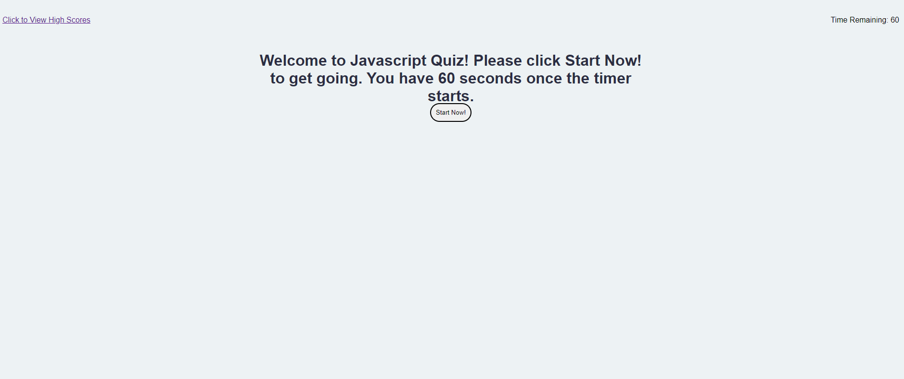

# Java Script Test = Cardiac Arrest 💔🩺

Welcome to the world's ~~best~~ working javascript-based Javascript Test!

## Description
This project exits to challenge my javascript abilities and it definitely did so

- What is it?

This is a very basic javascript quiz app. When the page is opened a greeting is presented with a button that starts the game. Every time a user guesses a question incorrectly they are penalized 10 seconds. When the clock runs down OR when the user gets through the list of questions, the game is over and they are presented with an input to enter their name. When they enter their name they are taken to a scores page where they should see their name reflected along with their score. If they return to the main page they can try again.

- How does it work?

The application creates list elements for each of the potential answers stored in the Question object's answer array and sets the text appropriately this allows for flexibility with questions that have varying amounts of multiple choice answers. These all have event listeners created, on them, I know it could probably be refactored to have the listener on the overall OL but hey we're here. The clicked answer is checked against the Question Object's answer property's value and increments score ✅ or subtracts time ❌ based on if the answer is correct. When the game ends, user stores their name and score into an object that gets strigified and later parsed to be added to high score table.

- What does it solve?

This allows a person to quiz themselves on content that they have learned. The application tracks which questions have been asked to in theory be able to replace the questions back into the question array for replaying. The format of the questions can be utilized to study an array of different topics simply by switching out which questions are pulled by the main program.

- Problems Encountered

Many. This one took a lot of work and despite the fact that I did some pseudo-coding, I think I could have spent a lot more time in the planning stage to get a better grasp on what needs to happen. I'm also not super pleased with the overall look and CSS, especially on the high score. I took some time and branched a few times to test what that process was like for working on potential solutions and it went well.

Still through all of this, it's here, it works, it's in tune, it's on time. 

## Deployed Site

[Live site here](https://hburnton.github.io/javascriptTestCardiacArrest/)

## Credits
My brain is very happy that somebody made this shuffle function to add a bit of spice to the badboi so that questions and multiple choice answers are shuffled.
https://stackoverflow.com/questions/2450954/how-to-randomize-shuffle-a-javascript-array\

Additionally questions were sourced from week three google sheets quiz about javascript from bootcamp spot. 